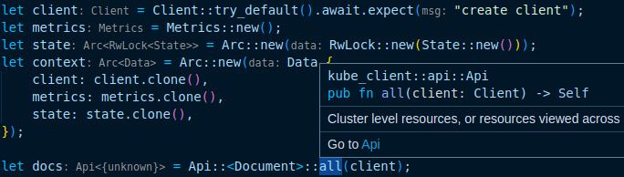
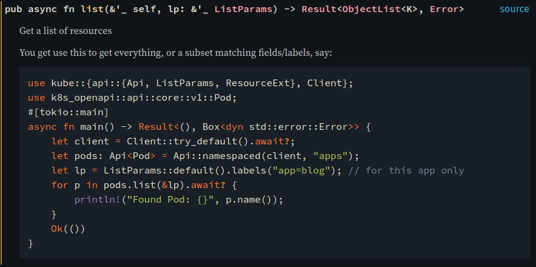
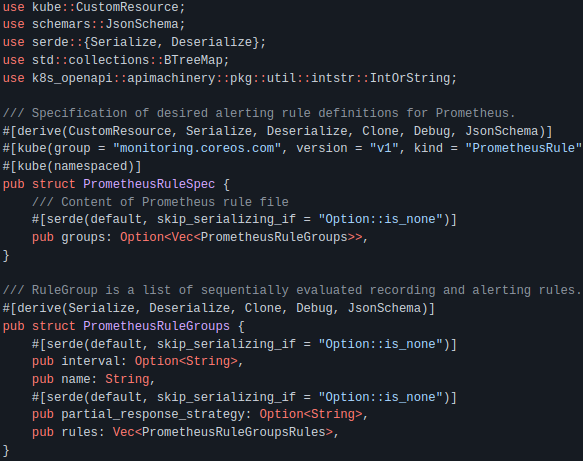

### Kube-rs Office Hours

- Eirik Albrigtsen
- [github/clux](https://github.com/clux) / [twitter/sszynrae](https://twitter.com/sszynrae)
- slides at http://clux.github.io/kubecon2022
- [https://kube.rs](https://kube.rs)

notes:
- eirik - a maintainer on kube-rs, VofficeHr first time.
- links, me, sources, slides (under my github), kube-rs has website
- purpose: quick intro, answer basic what is / future goals, and give a quick ecosystem tour
- q/a in about 20min time

---
<a href="https://kube.rs/"></a>

- Rust client for Kubernetes inspired by client-go <!-- .element: class="fragment" -->
- Runtime inspired by controller-runtime <!-- .element: class="fragment" -->
- Derive macro for CRDs inspired by kubebuilder <!-- .element: class="fragment" -->
- kube crate == everything <!-- .element: class="fragment" -->


notes:
- a rust ecosystem for kubernetes apps; client-go, controller-runtime, kubebuilder
- managed in a single repo that's versioned together
- facade crate called `kube` where you can enable exactly the subset of that that you want
- tons of people have helped make kube support almost as wide as the go land

---
​

- Safety + Expressiveness <!-- .element: class="fragment" -->
- Major adoption even in big companies <!-- .element: class="fragment" -->
- Very popular among developers <!-- .element: class="fragment" -->

notes:
- very hard to write a large class of common errors, such as null ptr deref and data races
- expressive types that can deal with real world complexity, doesn't hide things
- starting to get huge adoption in major companies (aws/microsoft/bouyant/datadog projs)
- huge popularity, stackoverflow survey has topped it since 2015 - why? DEVX

---
​

- Developer experience <!-- .element: class="fragment" -->



- Safety <!-- .element: class="fragment" -->
- Documentation <!-- .element: class="fragment" -->

notes:
- error messages tell you what to do, compilers and linters can --fix your code
- rust-analyzer: vs code into ide, gray => types, not in the source, browse to source outside your crate (even in stdlib)
- much easier to reason about part of code that matters - easy to give to juniors and easy to review (logic errors only), never afraid to merge

---
### docs.rs


notes:
- docs, signature, clickable links to all types, view source - every crate has this on docs.rs
- examples these are guaranteed to build, many runnable
- rip stackoverflow

---
### Why Not Rust

- Kubernetes + client-go comes first
- Rust is behind <!-- .element: class="fragment" -->
- Rust support needs community support <!-- .element: class="fragment" -->
- Outstanding features <!-- .element: class="fragment" -->

notes:
- all sorts of lofty ideas as to why you might choose rust over go here, and you are likely self-selecting, but there are concerns
- we are playing catch up, and need community support (more obscure features might require elbow grease)
- on the plus side the main kubernetes generics (what we rewrite) dont change very often
- but there are things we don't have yet like protobuf support and apply configurations

---
### Rust Kubernetes Client

- Config
- Client
- Api

notes:
- 1st; kube_client crate. Config (disk config repr or in-cluster evar repr)
- that can be turned into a Client (config is just conn/tls params)
- with a client you can make api instances; do operations on k8s resources
- Api opaque wrapper type that can absorb openapi generated kubernetes type (very ez to interact)

---
### Client Standard

```rust
let client = Client::try_default().await?;
```

same as:

```rust
let config = Config::infer().await?
let Client = Client::try_from(config)?;
```

notes:
- 99% use case; checks local config, then does cluster auth
- creates a client from this inferred config with default parameters
- default parameters are very tuned and all the layers of these are available
- layers?

---
### Client Advanced

```rust
let config = Config::infer().await?;
let https = config.rustls_https_connector()?;
let service = tower::ServiceBuilder::new()
    .layer(config.base_uri_layer())
    .option_layer(config.auth_layer()?)
    .service(hyper::Client::builder().build(https));
let client = Client::new(service, config.default_namespace);
```

notes:
- layers; tower; service builder trait - complex thing great for api libs
- our Client is "just a Service" composed of our default layer and a connector
- closest thing we can get to sans-io in rust
- bring something that implements a Service and you can customize

---
### Client Standard

```rust
let client = Client::try_default().await?;
```

- works inside and outside cluster
- hyper by default <!-- .element: class="fragment" -->
- uses available tls stack <!-- .element: class="fragment" -->
- sensible default layers <!-- .element: class="fragment" -->

notes:
- in practice; just use the above, get light-weight hyper (likely in tree)
- we deal with both major ssl stacks, we'll have good default trace layers
- and hyper is a great http client that's probably alerady in your dependency tree
- and when you have a Client, you can query the api

---
### Api Basic 1

```rust
let nodes: Api<Node> = Api::all(client);
let n = nodes.get("k3d-main-server-0").await?;

for node in nodes.list(&ListParams::default()).await? {
    println!("Found node {}", node.name());
}
```

notes:
- you can do get and list operations on resources (here nodes)
- note async syntax in rust to await return from api

---
### Api Basic 2

```rust
let pods: Api<Pod> = Api::default_namespaced(client);
let p = pods.get("blog").await?;

for pod in pods.list(&ListParams::default()).await? {
    println!("Found pod {}", pod.name());
}
```

notes:
- api is generic, same interface for all pods
- methods: get/list/delete/delete_collection/replace/create/patch and watch

---
### Api subresources 1

```rust
let pods: Api<Pod> = Api::default_namespaced(client);
let status = pods.get_status("blog").await?
```

generic subresources:

- Status
- Scale

notes:
- standard subresource operations
- Status + Scale are the two main generic subresources
- can patch/replace these

---
### Api subresources 2

```rust
let pods: Api<Pod> = Api::default_namespaced(client);

let cmd = vec!["sh", "-c", "for i in $(seq 1 3); do date; done"]
let params = AttachParams::default().stderr(false);
let attached = pods.exec("blog", cmd, &params).await?;
```

special subresources
e.g. pods/{logs,exec,attach,portforward,evict}

notes:
- we also implement all the special subresources for special case resources
- insofar as they are subresources certificatesigningrequests/approval, but node cordon isn't
- you can exec into pods, and you get a set of io streams back that you can tail or pipe into another streams
- i.e. take stdin from your cli and pipe it to a container => teleport
- or you can issue kill signals, controller called hahaha that kills sidecars in jobs when main container is dead

---
### Api::watch

```rust
let pods: Api<Pod> = Api::default_namespaced(client);

let mut stream = pods.watch(&lp, "0").await?.boxed();
while let Some(we) = stream.try_next().await? {
    // TODO: match on we: WatchEvent
}
```

raw watch events

notes:
- streams; async iteration; unlike list where we had to await the full list
- here we await each element - in theory this runs forever
- but in practice no, because the watch api is kind of bad; desync/reset/resource vers/bookmarks/pre-lists
- also WatchEvents wrap - which it's actually unsafe to rely on
- don't want to use this manually unless you really know what you're doing

---
### kube-client

docs.rs/kube + kube-rs/examples

- docs.rs/kube [`kube::Client`](https://docs.rs/kube/latest/kube/struct.Client.html)
- docs.rs/kube [`kube::Api`](https://docs.rs/kube/latest/kube/struct.Api.html)
- [examples](https://github.com/kube-rs/kube-rs/tree/master/examples)
- [examples/kubectl](https://github.com/kube-rs/kube-rs/blob/master/examples/kubectl.rs)

notes:
- basics of a client library - api mirrors what the api is - no magic extensions just the api
- we support pretty much the full api, so that's super close to client-gold
- but we don't have protobuf support yet -> codegeneration

---
### Code Generation

- k8s-openapi
- k8s-pb
- kube-derive
- kopium
- schemars


notes:
- big part of rust eco, structs generally come from go, so need to implement them in rust via schemas
- also want to reduce the boilerplate code you have to write, helper fns, builders
- want this to be attractive from people coming from go ecosystem
- lots of efforts around - not just from us
- mention the components briefly because feeds into future plans & references exposed dependencies

---
### Codegen; k8s-openapi

```rust
use k8s_openapi::api::core::v1::{Pod, Node};
use k8s_openapi::apiextensions_apiserver::pkg::apis{
  apiextensions::v1::CustomResourceDefinition
};
```

notes:
- openapi -> struct gen, got all native k8s types
- hefty import paths that mirror the kubernetes paths, everything's versioned
- one of oldest part of rust ecosystem, upstreamed numerous schema bugs, hardly any problems now
- but: not using protobuf

---
### Codegen; k8s-pb

```rust
use k8s_pb::api::core::v1::{Pod, Node};
use k8s_pb::apiextensions_apiserver::pkg::apis{
  apiextensions::v1::CustomResourceDefinition
};
```
**WIP**

notes:
- working on a pb version of this - but they are usable yet.
- the goal is that this will be the drop-in replacement for kube
- and we have tons of ideas of how this can improve the life of people interacting with big and bulky structs filled with option types


---
### Codegen; CustomResource derive

```rust
#[derive(CustomResource, Deserialize, Serialize, Clone, Debug)]
#[derive(JsonSchema)]
#[kube(group = "kube.rs", version = "v1", kind = "Document")]
#[kube(namespaced, shortname = "doc")]
pub struct DocumentSpec {
    title: String,
    hide: bool,
    content: String,
}
```

```rust
let api: Api<Document> = Api::default_namespaced(client);
let d = Document::new("blogpost", DocumentSpec { ... });
```


notes:
- crd writing; need to wrap (apiVersion, Kind, metadata). our kube-derive proc_macro does this (derive CR)
- generates the top level type (Document), creates builders. can create doc easily, and pass it to api.create
- all integrated into cargo/rust, no generated code in your repo
- can configure everything in a kubebuilder style
- Document also gets a crd method to generate the crd with the schema (can ship/write to disk) (via schemars)

---
### Codegen; Schemars

```rust
#[derive(JsonSchema)]
pub struct MyStruct {
    my_bool: bool
}
```
generates
```json
{
  "title": "MyStruct",
  "type": "object",
  "required": [
    "my_bool",
  ],
  "properties": {
    "my_bool": {
      "type": "boolean"
    }
  }
}
```

notes:
- derive macro by schemars
- very popular library with lots of improvements in the last year
- kube-derive requires it (schemas req as of k8s 1.16)
- so deriving CR: rust -> schema, what about other way? go structs for CR?

---
### Codegen; kopium

```sh
curl -sSL https://somecrd.yaml | kopium -Af - > gen.rs
```



notes:
- kopium takes a crd with schema, and generates rust structs
- if you have a go controller, take its schema
- you got a big part of your rust controller there
- still pretty new, some issues, but definitely helping a lot of people


---
### Codegen

- k8s-openapi
- k8s-pb
- kube-derive
- kopium
- schemars

notes:
- first two; core kubernetes structs
- 3/4th; crds, kopium imports, kube-derive exports (requires schemars)
- crates or repos in their own right, we work on the middle 3

---
### Runtime

- watchers
- reflectors
- conditions
- controllers


notes:
- we are also runtime; kube_runtime runtime, similar to controller-runtime
- has api abstractions - client-go/tools
- watcher - to continuously watch an api forever
- reflector - to cache data
- controllers, glue it all together so you can build a reconciler around an owned object

---
### Runtime; watcher

```rust
let nodes: Api<Node> = Api::all(client);
let mut stream = watcher(nodes, lp).applied_objects().boxed();
while let Some(n) = stream.try_next().await? {
    info!("saw node {}", n.name())
}
```

notes:
- watchers; state machinery to keep a single continuous stream
- when you flatten the internal watch events stream with `applied_objects` you just get a stream of objects
- and it stays open forever
- works for every object because it takes an Api

---
### Runtime; reflector

```rust
let nodes: Api<Node> = Api::all(client);
let watch = watcher(nodes, lp);

let (reader, writer) = reflector::store();
let stream = reflector(writer, watch).applied_objects()
```

notes:
- reflectors; something you can chain a watcher stream into
- maintains a map of what's currently in the cluster
- writer is moved in to the reflector, you keep a reader handle
- can pass the reader handle to a web server or whatever, it's clonable
- and provides a way to query the cluster without making extra api calls

---
### Runtime; recorder

```rust
let recorder = Recorder::new(client, reporter, objref);
recorder.publish(Event {
    type_: EventType::Normal,
    reason: "HiddenDoc".into(),
    note​s: Some(format!("Hiding `{}`", name)),
    action: "Reconciling".into(),
    secondary: None
}).await
```

notes:
- eventrecorder fairly common that that's pretty clean already
- creates events, shows up in kubectl describe
- NB: zwsp in notes...

---
### Runtime; conditions

```rust
let crds: Api<CustomResourceDefinition> = Api::all(client);
let name = "documents.kube.rs";
let cond = conditions::is_crd_established();
let time = Duration::from_secs(10);
timeout(time, await_condition(crds, name, cond)).await?;
```

notes:
- conditions - abstraction that watches until a certain state in the status object has been seen
- we expose some basic conditions; is_deleted, is_crd_established, is_pod_running, but beyond that currently have small helpers
- tricky to write generically because objects don't need to have same fields, even spec/status conventions are even maintained within kubernetes
- can make this easier with next object generation setup (by selectively generating traits such as HasSpec and HasStatus or HasConditions)

---
### Runtime; controller

```rust
let ctx = Arc::new(Data { client });
Controller::new(crdapi, lp)
    .owns(configmaps, lp)
    .run(reconcile, error_policy, ctx)
```

notes:
- when you want to sync an object spec with some state
- you configure your main api, here some crd
- configure an owned resource (here configmaps), that will trigger reconcile of owning object by traversing ownerAnnotations
- you pass in two functions; reconcile and error_policy
- and you then have to write a reconciler

---
### Runtime; reconcilers

```rust
#[instrument(skip(ctx, doc))]
async fn reconcile(doc: Arc<Document>, ctx: Arc<Data>)
    -> Result<Action, Error>
{
    let client = ctx.client.clone();
    let ns = doc.namespace().unwrap();
    let docs: Api<Document> = Api::namespaced(client, &ns);
    // TODO: use doc spec to create/update owned resources
    Ok(Action::requeue(Duration::from_secs(30 * 60)))
}
```

notes:
- reconciler ends up like this - kube invokes it when your object changes
- or anything it owns or watches changes
- but it figures out what's the parent and that's what you get called for
- also get context you passed in.
- then you get to correct the state of the world.
- it's all very fun writing idempotent reconcilers, and i could talk for days about it
- we have a whole section dedicated to controller writing on our website - not all done - but if you need a controller go read it


---
### Runtime; finalizers

```rust
finalizer(&api, "docs.kube.rs/cleanup", obj, |event| async {
    match event {
        Event::Apply(api) => apply(api, ..args).await,
        Event::Cleanup(api) => cleanup(api, ..args).await,
    }
}).await
```

notes:
- common patterns like finalizers we have helpers, wrap reconcile, pass finalizer
- you can split your main reconcile into two fns apply/cleanup that you create


---
### Runtime End

- docs.rs [reflector](https://docs.rs/kube/latest/kube/runtime/fn.reflector.html)
- docs.rs [watcher](https://docs.rs/kube/latest/kube/runtime/fn.watcher.html)
- docs.rs [conditions](https://docs.rs/kube/latest/kube/runtime/wait/conditions/index.html)
- docs.rs [Controller](https://docs.rs/kube/latest/kube/runtime/struct.Controller.html)
- docs.rs [finalizer](https://docs.rs/kube/latest/kube/runtime/finalizer/fn.finalizer.html)

---
### Runtime End

- [kube.rs controller guide](https://kube.rs/controllers/intro/)
- [kube-rs/version-rs](https://github.com/kube-rs/version-rs/blob/main/version.rs)
- [kube-rs/controller-rs](https://github.com/kube-rs/controller-rs)

notes:
- 100 line reflector with axum, tracing, presents a deployment api
- best practices controller that we update with kube-rs; tracing, metrics, logs, crd generation from schema and kube-derive

---
<a href="https://kube.rs/"></a>

- Rust client for Kubernetes inspired by client-go
- Runtime inspired by controller-runtime
- Derive macro for CRDs inspired by kubebuilder
- kopium + k8s-pb (codegen)
- controller-rs + version-rs (examples)

notes:
- hopefully no need to reinvent the wheel
- first 3 in kube-rs repo, extra repos for codegen, big example repos in org
- mention discord / github discussions / issues


---
### EOF / QA

^C


:wq

&nbsp;

&nbsp;

&nbsp;

༼つಠ益ಠ ༽つ ─=≡ΣO))
---
### Api Patch

```rust
let pods: Api<Pod> = Api::default_namespaced(client);
let p: Pod = serde_json::from_value(json!({
    "apiVersion": "v1",
    "kind": "Pod",
    "metadata": { "name": "blog" },
    "spec": {
        "containers": [{
            "name": "blog",
            "image": "clux/blog:0.1.0"
        }],
    }
}))?;
pods.patch("blog", &serverside, &Patch::Apply(p)).await?
```

notes:
- you can patch, or serverside apply
- either from openapi generated structs
- or you can force serialize into structs with this syntax checked json macro
